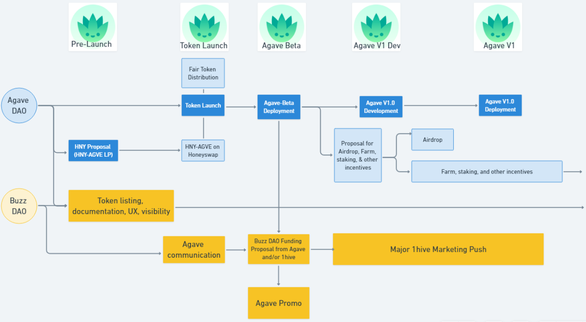

# FAQ Agave

## Général

**Quel est le ticker d’Agave et l’adresse du contrat ?**\
****$AGVE: 0x3a97704a1b25F08aa230ae53B352e2e72ef52843\
Blockscout: [$AGVE](https://blockscout.com/poa/xdai/address/0x3a97704a1b25F08aa230ae53B352e2e72ef52843/transactions)

**Qu’est-ce qu'Agave ?**\
****Agave, en deux mots, c'est Aave sur xDai. Consultez ces articles pour plus d’informations : [AGVE Token Launch 2](https://forum.1hive.org/t/ag-token-launch/2108) - [Announcing Agave, Aave on xDai](https://forum.1hive.org/t/announcing-agaave-aave-on-xdai/1792). Une introduction détaillée à Agave est également disponible sur notre page [Medium](https://medium.com/agavefr/introduction-%C3%A0-agave-85024f2b97d2).

**Quel est le total supply de $AGVE ?**\
****Total Supply : 100 k\
En circulation : 27.799 k\
Market Cap actuel : 13.5 M USD

**Existe-t-il un site sur Agave ?**\
****Un nouveau site est sur le point d'être prêt pour Agave. Vous pouvez déjà visiter la page d’accueil à l'adresse[ Agave.Finance](https://agave.finance).

**Où puis-je trouver des mises à jour régulières sur le projet ?**\
****Nous publions les mises à jour majeures concernant 1Hive et Agave sur notre page [Etapes](https://wiki.1hive.org/v/francais/projects/milestones).

**Quand le produit sera-t-il lancé ?**\
****Le produit Agave est actuellement en court d'audit afin d'assurer un lancement réussi. L'entreprise qui s'occupe de l'audit est [Chainsulting](https://chainsulting.de). Le produit Agave devrait être opérationnel dès que le processus d'audit sera terminé. Bien que l'espoir soit de sortir le produit prochainement, nous ne voulons pas précipiter le lancement.

Actuellement, nous terminons et relions les contrats sur le front-end. Sur le back-end, l'audit est en cours, et nous travaillons pour résoudre un problème lié au _subgraph_.

**Où puis-je trouver une feuille de route générique pour Agave ?**\
****Vous pouvez consulter la feuille de route d'Agave ici, sous réserve de modifications.

**Et le marketing ?**\
****Le marketing débutera dès le déploiement d'Agave, comme présenté dans la feuille de route. Tout marketing indirect avant le lancement du token se fera uniquement par le biais de propositions, de documentation et de listings de tokens.

Notre principal effort marketing sera réalisé en coordination avec le déploiement d'Agave, [Celeste](https://wiki.1hive.org/v/francais/projects/celeste), Honeyswap v3, pour promouvoir l'écosystème 1hive dans son ensemble.

**$AGVE est-il sur Coingecko?**\
****Oui ! Voici le lien :[ $AGVE - Coingecko](https://www.coingecko.com/en/coins/agave-token).

**Puis-je contribuer d'une manière ou d'une autre?**\
****Votre participation est toujours bienvenue. Quelques primes sont ouvertes, vous pouvez les voir [ici](https://www.notion.so/3e13ef2a5d614a828b684640af2212b4?v=20b21ead637341faa87416b85202b584) et les revendiquer en contactant Buzz Dao. Nous travaillons sur une proposition visant à créer de nouvelles primes accessibles à tous les utilisateurs, principalement liées aux listings de tokens. (Coinmarketcap, Blockfolio, Dappradar, Coinpaprika, Dune Analytics, etc.)

**Pourquoi n’étais-je pas éligible à l’airdrop ?**\
****Plus qu'un airdrop, le jeton $AGVE a été distribué aux contributeurs et aux membres actifs de la communauté 1Hive selon un instantané qui a eu lieu le 25 janvier. Vous trouverez [ici](https://forum.1hive.org/t/agave-contributor-distribution-announcement/2373) des informations sur l'attribution des jetons et la liste des adresses éligibles.

**Comment réclamer mon airdrop ?**\
****Si vous étiez éligible pour l’airdrop (veuillez consulter la liste d'adresses [ici](https://pastebin.com/hjYcbK1k)), votre part de $AGVE a déjà été envoyée dans votre portefeuille.

**Y aura-t-il d'autres airdrops ?**\
****Bien qu'il s'agisse de pure spéculation à ce stade, l'équipe a mentionné qu'à l'avenir, un airdrop marketing pourrait avoir lieu.

**Que s'est-il passé lors du lancement du jeton le 28 février ?**\
****Lors du lancement du jeton, les traders ont connu une forte volatilité en raison d'une erreur commise lors de l'ouverture du pool AGVE/HNY : le ratio prévu de 50HNY/10’000 AGVE a été fixé à 50HNY/1000AGVE. Cela a créé une chaîne d'événements qui a provoqué une volatilité extrême et l'équipe a retiré la liquidité et l'a réinsérée dans un autre pool (AGVE-WETH) au bon ratio. Certains utilisateurs peuvent avoir subi des pertes, tandis que d'autres peuvent en avoir profité. Veuillez lire [Réflexion sur le lancement d’Agave](https://forum.1hive.org/t/reflection-on-the-agave-launch/2517) pour connaître le contexte.

**J'ai été affecté par l'erreur concernant la liquidité initiale et j'ai acheté $AGVE à un prix très élevé. Que va-t-il se se passer maintenant ?**\
Étant donné que, lors du trading, la responsabilité incombe au trader, ceux qui ont été fortement affectés par le prix de $AGVE ont reçu une compensation proposée par les membres de l'équipe et votée par la communauté, décrite dans [cet article](https://forum.1hive.org/t/agave-reparations-proposal/2822).

**Où puis-je voir un graphique de $AGVE ?**\
****À l'heure actuelle, le graphique le plus « complet » d’Agave est sur[ Coingecko](https://www.coingecko.com/en/coins/agave-token). Le jeton a été lancé le 28 février et dès qu'un historique est chargé, vous pourrez consulter un graphique de $AGVE [ici](https://info.honeyswap.org/token/0x3a97704a1b25f08aa230ae53b352e2e72ef52843).

**Comment puis-je fournir de la liquidité et pour quelle paire ?**\
****Pour l’instant il y a trois paires $AGVE:[ AGVE-WETH](https://info.honeyswap.org/pair/0xeba7cc57e6f745b8d5cab829e07346c65393d78e),[ AGVE-HNY](https://info.honeyswap.org/pair/0x50a4867aee9cafd6ddc84de3ce59df027cb29084) et[ AGVE-XDAI](https://info.honeyswap.org/pair/0x0e3e9cceb13c9f8c6faf7a0f00f872d6291630de). Vous pouvez ajouter de la liquidité [ici](https://app.honeyswap.org/#/pool) → Add Liquidity → Sélectionner la paire.

**Puis-je stake $AGVE ?**\
****Pas encore, pour l’instant vous pouvez hold ou fournir de la liquidité.

**Comment suivre les prochaines annonces d'Agave ?**\
****Il y a plusieurs façons de suivre et d’être en contact avec la communauté Agave :\
Discord d'Agave : [Agave Discord 1](https://discord.com/channels/816889381737725963/816889382850134027)\
Discord de 1Hive : [1Hive Discord](https://discord.com/invite/xTZjbRjc8t) [1Hive - Agave Channel](https://discord.com/channels/698287700834517064/813823983120023583)\
Telegram : [https://t.me/Agave1Hive 1](https://t.me/Agave1Hive)\
Twitter : [https://twitter.com/Agave\_lending](https://twitter.com/Agave\_lending)\
Reddit : [https://www.reddit.com/r/AGVE/](https://www.reddit.com/r/AGVE/)

**Mon problème n'a pas été abordé dans la FAQ. Que puis-je faire ?**\
****La meilleure façon d'obtenir de l'aide d'un membre de la communauté 1Hive est d’aller sur la chaîne[⛈**help**](https://discord.gg/3AjG7XvRJZ) sur Discord.

## Staking 

**Puis-je stake $AGVE ?** \
Depuis le 10 mai, le staking d'Agave est enfin disponible. [Cliquez ici](https://app.agave.finance/#/stake) pour accéder à l'application.

**Qu'est-ce que le délai de **_**Cooldown **_**?** \
Le Cooldown est le temps que vous devez attendre pour retirer vos fonds stakés. Il s'agit d'un "module de sécurité". L'idée est que vous ne pouvez pas retirer immédiatement vos tokens stakés, puisque vous stakez pour vous protéger d'un événement _Shortfall_.

**Qu'est-ce qu'un **_**shortfall **_**?** \
[Cliquez ici](https://www.investopedia.com/terms/s/shortfall.asp) pour la définiton de shortfall.

**Que se passe-t-il lorsque je clique sur "Activate Cooldown" ?**\
Lorsque vous activez le cooldown, vous devez attendre 10 jours avant de débloquer vos tokens. Ensuite, vous aurez 2 jours pour cliquer sur "unstake", sans quoi il vous faudra recommencer et attendre à nouveau.

**Que se passe-t-il si vous n'effectuez pas de retrait pendant la fenêtre de 2 jours ?**\
Si vous ne retirez pas dans les 2 jours, la fenêtre se ferme et vous devez réactiver la période de cooldown.

**Est-ce que je continue à recevoir des récompenses de staking pendant la période de cooldown ?**\
Oui ! Vous recevez des récompenses de staking tant que vos tokens ne sont pas retirés.

**D'où viennent les 500 AGAVE ?**\
Les 500 Agave (0,5% de l'approvisionnement total) sont issus d'une proposition votée par la communauté lors d'un vote récent. [Cliquez ici](https://forum.1hive.org/t/agave-votes-apr-22/3489) pour en savoir plus.

**Si je stake AGAVE, est-ce que je reçois un token "stakedAGAVE" ?**\
Oui, vous recevrez des stkAGVE.

**Peut-on aussi voter avec stkAGVE ?**\
C'est en projet futur, cela sera possible. Actuellement, ce n'est pas possible, mais tout est en place pour permettre cette fonction une fois que nous aurons mis à niveau la DAO. Nous organiserons une "unstake party" pour voter lorsque cela se produira.

**Que se passe-t-il dans 6 mois, est-ce que ça se unstake automatiquement ? **\
Peut-être. Il se peut que vous ayez à unstake manuellement à ce moment-là. Nous vous informerons d'ici là de ce qui se passera à la fin de la période. Vous ne perdrez pas vos récompenses si vous ne vous désengagez pas immédiatement, mais vous devrez quand même faire face à la période de cooldown. Nous prévoyons une transition vers un système offrant une part des récompenses du protocole lors de son lancement, auquel cas vous ne voudrez jamais unstaker.

## Alvin&#x20;

**Que s'est-il passé avec Alvin ?**\
Le 25 mai 2021, les pools de liquidités de [http://dripp.farm](http://dripp.farm) ont été vidés (tokens ALVIN et SHWEATPANTS), entraînant un effondrement des prix. Agave n'est pas responsable de ce qui s'est passé - ni affilié au créateur du projet - mais nous soutiendrons les membres de notre communauté qui ont subi des pertes. Lisez [ici](https://forum.1hive.org/t/dripp-farm-a-retrospective/3895) le post-mortem et ce [post du forum](https://forum.1hive.org/t/alvin-and-the-dripp-ocalypse/3757) pour plus d'informations.

**Qui est Alvin ? Qu’est-ce que c’est ?**\
****Alvin est un erc20 échangeable (en nombre entier) contre une peluche en édition limitée du personnage du logo agave (nommé Alvin) et un NFT - Non Fungible Token. Inspiré par le succès d’Unisocks (d'une valeur de plus de 100k au moment de la rédaction), il s'agit de la première collaboration (Cross-Pollination) entre [1Hive](https://1hive.org) et [Shenanigan](https://she.energy).&#x20;

**Puis-je encore recevoir ma peluche Alvin (ou Shweatpants) ?**\
À ce stade, nous recherchons une solution équitable pour résoudre la situation, en tenant compte des besoins et des droits de toutes les personnes concernées. Nous informerons la communauté dès que nous aurons quelque chose de concret à partager.
