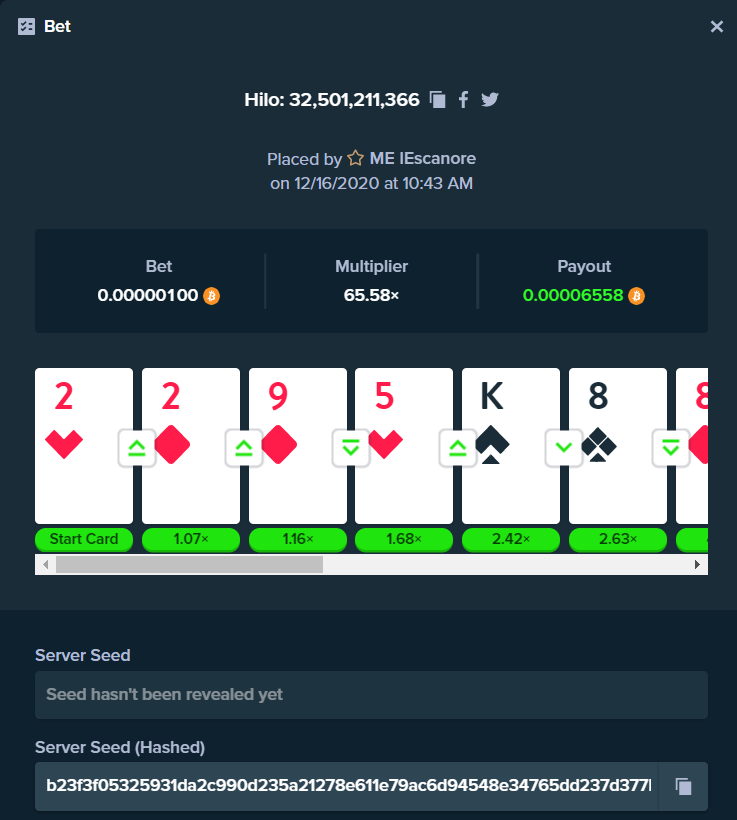

# FAQ

## Allgemeine Fragen

**Wird es einen Honey Airdrop geben?**   
  
Im Moment gibt es keine Pläne für einen Airdrop. Mitglieder der 1Hive-Community können Honey durch [Faucets](https://faucet.1hive.org/#/) und durch [Pollen](https://1hive.gitbook.io/1hive/getting-started/pollen) verdienen, indem sie an Discord, dem Forum und Github teilnehmen.

Derzeit ist die Mehrheit der Gemeinschaft der Ansicht, dass Honey Airdrops keine positiven Auswirkungen auf den Preis und die Nachhaltigkeit des Projekts haben würde.

**Wird das Faucet aufgeladen? Was passiert, wenn es vorbei ist?**   
  
Das Faucet zahlt alle 48 Stunden 5% seines Guthabens aus; Daher ist es nie wirklich “zu Ende”. Es gibt jedoch Diskussionen über eine Aufstockung, um sie als Anreiz für Neueinsteiger zu haben. [Hier](https://forum.1hive.org/t/temporarily-suspend-the-faucet/1580/2) können Sie darüber lesen und Ihre Meinung zu diesem Thema mitteilen. Bisher wurden über 600 HNY über das Faucet verteilt .

**Wann werden die Farmen wieder geöffnet?**   
  
1Hive führte 2 Farmperioden durch; Die letzte endete am 25. Dezember 2020. Derzeit sind die Betriebe inaktiv und es gibt keine Vorschläge für Betriebe, die in naher Zukunft verabschiedet werden sollen.

**Ist das Team vertrauenswürdig?**  
  
1Hive ist eine DAO \(Decentralized Autonomous Organization\), was bedeutet, dass das Team aus seinen Gemeinschafts-Mitgliedern besteht. Jeder kann der 1Hive-Gemeinschaft beitreten, ihr Wachstum fördern und Ideen / Kooperationen aller Art vorschlagen.

**Was ist eine DAO?**   
  
Dezentrale autonome Organisationen sind Koordinierungsprotokolle, die es Menschen ermöglichen, gemeinsam auf ein gemeinsames Ziel hinzuarbeiten, indem sie Interaktionen durch in der Software definierte Regeln regulieren. DAOs sind einzigartig, weil sie die Automatisierung in den Mittelpunkt stellen und den Menschen an den Rändern. Es gibt weder einen CEO noch Manager. Verwaltung, wo sie existieren muss, wird als Konstruktionsfehler angesehen und rücksichtslos minimiert.

Während die zentralisierte Verwaltung ein leistungsfähiges und flexibles Mittel zur Skalierung der menschlichen Koordination darstellt, hat das Aufkommen von dezentralen Hauptbüchern wie Bitcoin und Ethereum gezeigt, wie störend, leistungsfähig und belastbar ausreichend dezentrale Koordinierungsprotokolle sein können. DAOs ersetzen keine Unternehmen. Stattdessen verändern sie die Wirtschaftslandschaft, indem sie neue Märkte und Möglichkeiten schaffen, an denen Einzelpersonen und Unternehmen teilnehmen können.

Im Fall des 1Hive DAO wird eine Gemeinschaftswährung namens Honey verwendet, um eine Kreislaufwirtschaft zu schaffen, in der öffentliche Güter und Investitionen, die die 1Hive-Wirtschaft fördern, gemeinsam durch [Conviction Voting](../projects/honey/) finanziert werden können.

**Hat 1Hive eine Roadmap?**

Wir haben grobe [Meilensteine](../projects/milestones.md), die von einzelnen Schwärmen aktualisiert werden.

**Kann man mit Honey stake ansetzen?** 

Wir sind stolz, Dir mitteilen zu können, dass [Celeste ](https://celeste.1hive.org/#/dashboard)seit dem 11. April endlich live ist. Benutzer können ihr HNY anlegen und können zur Klärung von eventuell auftretenden Streitigkeiten herangezogen werden. Klicke [hier](https://1hive.gitbook.io/celeste/), um zum Celeste-Wiki zu gelangen, wo alle wichtigen Informationen zu finden sind.

**Wie hoch ist der APY \(jährlicher Prozentertrag\) für das Anlegen von HNY mit Celeste?** 

Im Moment können wir keine Schätzung des APYs durch Celeste geben, dessen Hauptzweck es ist, der Community ein Werkzeug zur Verfügung zu stellen, um missbräuchliches Verhalten zu verhindern. Die Staking Rewards sind ein positiver Nebeneffekt dessen. Um an Celeste teilzunehmen, musst Du mindestens 0,5 HNY haben, und die Staking Rewards werden monatlich ausgezahlt.

**Gibt es einen Anreiz, Honey zu besitzen?** 

Wenn Du mindestens 0,5 HNY hast, kannst Du an [Celeste ](https://1hive.gitbook.io/celeste/)teilnehmen. Abgesehen davon dient der Besitz von Honey in erster Linie dazu, über Vorschläge abzustimmen und [Liquidität bereitzustellen](https://link.medium.com/Zb26x6KQWcb).

**Wann wird Honey auf Uniswap sein?**

Die umgekehrte Omnibridge, die es ermöglicht, Honey auf das Mainnet zu verschieben, um es zu Uniswap hinzuzufügen, wird höchstwahrscheinlich in Q1-Q2 2021 auf dem Ethereum Mainnet landen.

**Ich habe einen "Matic"-Kanal auf Discord gesehen. Verlassen wir xDai?**

Derzeit gibt es keine Pläne, xDai zu verlassen, aber 1Hive untersucht, welche Möglichkeiten bestehen könnten, um die Community und das Ökosystem von Produkten auf zusätzliche Netzwerke wie Matic und in Entwicklungs-Roll-up-Ketten wie Arbitrum auszudehnen.

**Kostet das "Abstimmen über einen Vorschlag" tatsächlich Honey?** 

Nein, das tut es nicht. Du gibst Dein HNY nicht aus, wenn Du abstimmst. Dein HNY ist auch nicht gesperrt - Wenn Du möchtest, kannst Du Deine Stimme zurückziehen und stattdessen handeln.

## **Token-Ekonomik**

**Wie lautet die Honey \(HNY\) token Adresse?**  
[0x71850b7E9Ee3f13Ab46d67167341E4bDc905Eef9](https://blockscout.com/poa/xdai/tokens/0x71850b7E9Ee3f13Ab46d67167341E4bDc905Eef9/)

**Warum Honey?**

Durch die Ausgabe einer digitalen Währung kann eine Community wie 1Hive eine Wirtschaft aufbauen.

Das Halten einer bestimmten Gemeinschaftswährung ist eine Wette auf das zukünftige Wachstum dieser Gemeinschaftswirtschaft. Je mehr Menschen die Währung halten, desto mehr Menschen werden Interesse an einer Teilnahme und einem Wachstum der Wirtschaft haben.

Jede Gemeinschaft kann unterschiedliche soziale Normen anwenden und unterschiedliche Ausstellungs- und Verteilungsrichtlinien verwenden, um gemeinsam genutzte Ressourcen zuzuweisen. Die effektivsten Gemeinschaften werden gedeihen und wachsen und um die Aufmerksamkeit und Loyalität des Einzelnen konkurrieren. Die Entscheidung, eine bestimmte Währung zu halten, wird sich über eine finanzielle Entscheidung hinaus zu einer politischen und sozialen Entscheidung entwickeln.

Diese Art von Wettbewerb ist gut für alle und sollte hoffentlich zu einer Zukunft führen, die freier, fairer, offener und menschlicher ist.

**Was ist die aktuelle Marktkapitalisierung von Honey?**

Die Marktkapitalisierung finden Sie hier auf [CoinGecko](https://www.coingecko.com/en/coins/honey).

**Wie berechnet sich die Marktkapitalisierung von Honey?**

Marktkapitalisierung = \(Gesamtangebot - gemeinsamer Pool\) x Honey-Preis

**Was ist die aktuelle Emissionsrichtlinie von Honey?**

Nach einer anfänglichen Inflationsrate von 60%, die von der Community auf 30% pro Jahr reduziert wurde, wurde eine dynamische Inflationsrate entwickelt, die ab April 2021 integriert wird. Klicke [hier ](https://forum.1hive.org/t/dynamic-honey-supply-policy-proposal/2224)und [hier](https://wiki.1hive.org/projects/honey/planned-improvements#dynamic-issuance-policy), um mehr Hintergrundinformationen zu erhalten, und auf die [Emissionsseite ](https://wiki.1hive.org/projects/honey/issuance)für weitere Details.

**Wohin geht die neu gemünzte Währung?**

Die Inflationsrate wird verwendet, um den Gemeinschaftspool zu füllen, der den Honey enthält, den das DAO zur Verfügung hat, und der nur durch Verabschiedung von Honey-Vorschlägen entnommen werden kann.

Der gemeinsame Pool wird zur Finanzierung von Pollen, Faucets, Bounties und der Zusammenarbeit mit anderen Projekten verwendet, die möglicherweise in Zukunft stattfinden werden.

Wie lautet die gemeinsame Pooladresse und wo können die Tokenübertragungen angezeigt werden?

[0x05e42c4Ae51BA28d8aCF8c371009AD7138312CA4](https://blockscout.com/poa/xdai/address/0x05e42c4Ae51BA28d8aCF8c371009AD7138312CA4/token-transfers)

**Wo kann ich Details zu Honey sehen?** 

In [Blockscout](https://blockscout.com/poa/xdai/) können Sie jede Transaktion in der xDai-Kette verfolgen. [Hier](https://blockscout.com/poa/xdai/address/0x71850b7E9Ee3f13Ab46d67167341E4bDc905Eef9/transactions) können Sie die von HNY verfolgen.

## xDai & Honeyswap

**Metamask einrichten**   
[https://honeyswap.org/setup-wallet](https://honeyswap.org/setup-wallet)

**Überbrücken Sie ein beliebiges Token**   
[https://honeyswap.org/xdai-bridges](https://honeyswap.org/xdai-bridges)

**Bereitstellung von Liquidität für Honeyswap**   
[https://honeyswap.org/liquidity-pool](https://honeyswap.org/liquidity-pool)

**Liquidität verstehen**  
[https://honeyswap.org/yield-farming](https://honeyswap.org/yield-farming)

**Sind die Transaktionsgebühren wirklich geringer als 0,01 USD?**

Im Allgemeinen ja, denken Sie daran, den Gaspreis in Ihrer Brieftasche auf 1 GWEI zu setzen, wenn Sie Transaktionen einreichen. Beachten Sie, dass 1 xDAI einem Wert von 1 USD entspricht. Verwenden Sie das [xDai-Faucet](https://xdai-faucet.top/), um eine kleine Menge xDAI für die Nutzung des Netzwerks zu erhalten.

**Wenn die Gebühren so gering sind, wie viel kann ich mit Liquidität verdienen?**

Die in Honeyswap-Trades verdienten Gebühren betragen 0,25% des Wertes des Trades, der stattgefunden hat. Sie beziehen sich nicht auf die Gasgebühren, die an das Netzwerk \(in unserem Fall xDAI\) zur Ausführung der Handelstransaktion gezahlt werden. Liquiditätsanbieter erhalten keine der Gasgebühren des Netzwerks, sondern 0,25% des Wertes der Swaps, die zwischen allen Liquiditätsanbietern in diesem Paar aufgeteilt sind.

**Kann ein ERC-20-Token mit Honeyswap gebrückt werden?**  
  
Ja, jeder ERC20, ERC677 und ERC827 kann durch Befolgen einiger einfacher Schritte und Verwenden der [Omnibridge](https://omni.xdaichain.com/) ausgetauscht werden.

## **Unterstützung**

**Ich bin neu in der Community. Was soll ich tun?**  
  
Zunächst einmal herzlich willkommen! Folgen Sie uns auf [Telegram](https://t.me/honeyswapDEX), [Discord](https://discord.com/invite/xTZjbRjc8t), [Twitter](https://twitter.com/Honeyswap) und stellen Sie sich in unserem [Forum](https://forum.1hive.org/t/introduce-yourself-to-1hive-thread/130/7) vor. Wenn Sie ein paar einfache Schritte folgen, heißt Sie 1Hive zusätzlich mit der [Welcome Bounty](https://docs.google.com/forms/d/e/1FAIpQLSdP3pTX_BLKqLCmkC84YyDj8PVK5wfOSSaym93SJj5KX6RP2w/viewform) willkommen! Sie können 1xDai verdienen, was für das Faucet und unzählige Transaktionen ausreicht!

**Ich kann mein HNY nicht über das Faucet beanspruchen, die Transaktion schlägt fehl.**   
  
Bitte stellen Sie sicher, dass Sie mindestens 0,5 xDai in Ihrer Brieftasche haben! 

**Ich habe mein Token überbrückt, aber ich sehe es nicht auf MetaMask. Was ist falsch?**

Keine Sorge, Ihre Token sind sicher. Wenn Sie Mitglied der xDai-Kette sind, müssen Sie Ihrer MetaMask-Erweiterung eine neue Token-Adresse hinzufügen.

Um ein Token hinzuzufügen, suchen Sie zuerst die Token-Adresse aus einer dieser Listen: [Bridged Tokens - Blockscout](https://blockscout.com/poa/xdai/bridged-tokens) / [Token List](https://tokenlists.org/token-list?url=https://tokens.honeyswap.org). Öffnen Sie dann Metamask → Token hinzufügen → Benutzerdefiniertes Token → Kopieren Einfügen der Token-Adresse. 

**Wie kann ich meine Honeyswap V2-Liquidität mithilfe von LP-Token abheben?**   
  
Sie können dies tun, indem Sie auf [Honeyswap](https://app.honeyswap.org/#/swap) → Pool → Liquidität entfernen klicken \(das Laden kann einige Momente dauern\). 

**Was ist der einfachste Weg, um xDai zu kaufen?**   
  
Du kannst DAI in xDAI aus dem Ethereum-Netzwerk mit der [Brücke ](https://dai-bridge.poa.network/)überführen, oder Du kannst xDai an der Börse Bitmax \(Ascendex\) oder mit Fiat auf [Ramp ](https://ramp.network/buy/?swapAsset=XDAI)kaufen. Vor kurzem wurden weitere Brücken implementiert \(einige in der Beta-Version, Vorsicht bitte!\), wie die [xDai-Polygon - Brücke](https://www.youtube.com/watch?v=RlcyBtz3R2w) \([Anleitung](https://medium.com/1hivede/einf%C3%BChrung-xdai-zu-matic-polygon-matic-polygon-zu-xdai-connext-br%C3%BCcke-c4f1eaff0f70?source=collection_home---6------0-----------------------)\) und die [xDai-Bsc Chain - Brücke](https://www.youtube.com/watch?v=mGqKPqCF6Zc&t=19s) \([Anleitung](https://medium.com/1hivede/binance-smart-chain-xdai-br%C3%BCcke-82744c3b9f4b?source=collection_home---6------2-----------------------)\).

**Gibt es ein Tutorial zum Kauf von xDai und zur Verwendung von Honeyswap?**  
  
Um Honeyswap zu verwenden, müssen Sie einige einfache Schritte ausführen: Senden Sie zunächst Ihr Token \(z. B. DAI\) an Ihr Metamask im Ethereum-Netzwerk. Sobald Sie einen xDai-Netzwerk-RPC erstellt haben, können Sie Ihr Token schnell über die Token-Bridge überbrücken \(für eine solche Transaktion benötigen Sie ein paar US-Dollar ETH\). [Hier](https://medium.com/honeyswap/introducing-honeyswap-fa34b24e6978) können Sie mehr lesen und [hier](https://forum.1hive.org/t/1hive-101-beeginner-video-tutorials/217?u=jasper) ein Tutorial ansehen. 

**Das Faucet erkennt mein Wallet nicht mehr und fordert mich auf, eine andere Brieftaschenadresse zu verwenden.** 

Bitte registrieren Sie sich mit einem anderen Wallet. Sie müssen leider erneut auf die Registrierungsfrist warten, bevor Sie einen Anspruch geltend machen können, aber dann haben Sie keine weiteren Probleme.

**Mein Problem wurde in den FAQ nicht behandelt. Was kann ich machen?**

Der beste Weg, um Hilfe von einem Mitglied der 1Hive-Community zu erhalten, besteht darin, auf dem  
 [⛈help](https://discord.gg/3AjG7XvRJZ)-Kanal von Discord zu landen.

