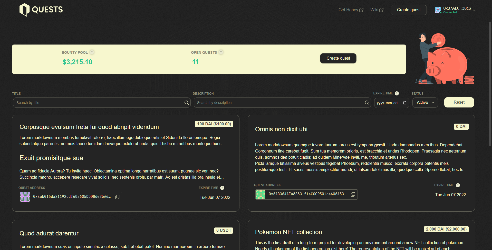
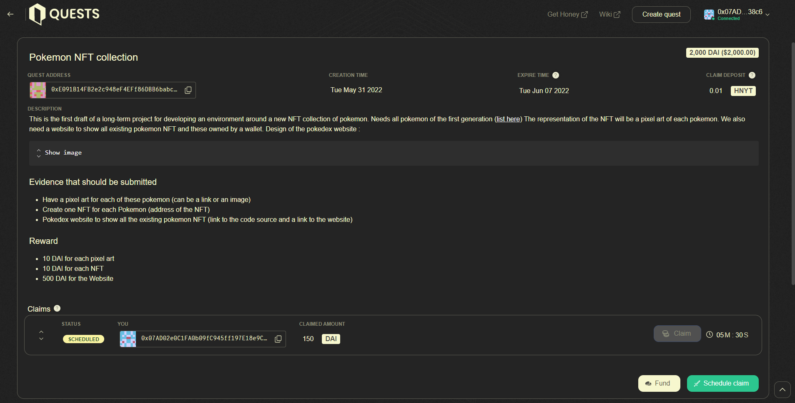

# Quests

Quests is a Celeste enabled incentivised bounty platform allowing users or organisations to publish bounties for work which anyone can claim by providing evidence of completion. Quests are open ended and are defined purely by a text description, quest players submit a text description as evidence for completing a quest which can be verified by other users and disputed with Celeste should the evidence not meet the original quests criteria.

## 🧚 Roles

- Creator : Promoters having a requirement or a task
- Player : People that complete the task defined in a Quest
- Patrons : Investors that fund a Quest

## Overview

Each quest is a single contract and consists of:

- A title and [description](quests.md#quest-descriptions) of the work required.
- The reward ERC20 token which any user or organisation can send to the quests contract address to fund.&#x20;
- An expiry time and refund address.

Quest players submit claim requests for a quest, including evidence, for some or all of the quests available bounty, along with a deposit. The claim request is fulfillable after a 7 day delay period.&#x20;

During the delay period other users can [verify](quests.md#verifying-a-quest) that the evidence submitted demonstrates completion of the quest. If they believe that the quest has not been completed to the standard specified in the quest [description](quests.md#quest-descriptions) then it can be challenged, also requiring a deposit, and raising it to Celeste which will decide whether the work has been completed as expected or not.&#x20;

The Celeste outcome will determine whether or not the claim request should be fulfilled and who is rewarded with the participants deposits. Whoever out of the player and challenger loses will lose their deposit to the winner.

## Quest descriptions

Quest descriptions are open ended but must include details of the work required, payment criteria and amounts, and evidence required to verify completion. Upon completion of the quest, players specify the reward amount in the claim request, which may be the full amount held by the quest or a portion, depending on how the quest defined the payment criteria.

A quest that is intended to be completed only once would define in the payment criteria that it would reward all of its bounty to the first player to successfully submit a claim request. However, a quest intended to be completed multiple times, for example “writing a blog post with your vision for 1Hive” could define the payment criteria such that each completion receives 1 HNY or perhaps a diminishing reward. Eg the first submission receives 2 HNY the second receives 1.5 HNY and each subsequent completion receives 0.5 less HNY than the last.

The evidence required for completing a quest will depend on the work expected. For a quest on writing a blog post, the evidence required will likely include a link to the blog post. It may also specify the minimum length of the blog post and that it hasn't been copied from somewhere else. For a quest on adding a feature to a web UI, the evidence required will likely include a link to the code written, some screenshots of the deployed feature and some reference to the code standard expected.

## Pages

### List view

This page consists of a small dashboard and a list of summarized Quests.

The dasboard shows the following information:

- Total of the active Quests bounties in USD
- Number of active Quests
- A **Create quest** button

> *Note that the USD value is computed from some stable coins, the list of these stable coins is avalaible in the footer. This list can be adjust on demand to include more pairs.*

This list can be filtered by Quest title, description, expiration date and state.

The expired Quests can be accessed by selecting **Expired** in the state filter.

### Detail view

This page is the detailed version of the quest showing more information :

- The claim deposit (amount locked during the claiming process)
- The full description (not summarized)
- The list of the **Players**' claims
- The action buttons (needs to be connected)
  - Fund (where Patrons can fund the quest)
  - Schedule claim (where Players can submit their evidence of task completion)

## Create a quest

**Creators** can create a Quest only when connected to a wallet.

The **Create quest** buttons will then appear in the header/dashboard/footer.

The creator must submit the following in 2 steps :

1. First:
   - Title
   - [Description](quests.md#quest-descriptions) (the field supports markdown)
2. Second:
   - Funding token (any token address can be put in the field)
   - Initial bounty
   - Expire time (after that, Players will not be able to schedule new claims)
   - Fallback address (the address where the funds can be restored once the quest expires)

> _The Creator needs to deposit a collateral that will be locked until the Quest expiration date. He will need to Reclaim the deposit to recover it_

## Fund a quest

**Patrons** can fund a Quest only when connected to a wallet. The Fund button is in the detail view of a Quest.

The Patron then submit the amount of the Quest reward token to be sent to the Quest bounty pool.

## Claim a Quest bounty

**Players** can claim the bounty only when connected to a wallet.

The **Schedule claim** button is in the detailed view of a Quest.

The submitted claim will be delayed for a specific period where other users can challenge the claim if the requirements of the Quest aren't met (see [verification of Quest](quests.md#verifying-a-quest)).

The Player msut submit the following in 2 steps :

1. First:
   - Evidence of completion (should meet the Quest description requirements)
2. Second:
   - The UI offers to claim all the Quest's bounty or just a specific amount (Player should pick what is specified in the Quest description)
   - Player's wallet address to which the reward should be sent

> _The Player needs to deposit a collateral that will be restored once the claim is executed._

When the delay will be over, the Player can execute the claim by clicking on the **Claim** button next to the corresponding claim. (Note that anyone can execute the claim if the Quest isn't expired)

## Challenge a claim

Anyone can challenge a **Player**'s claim when connected to a wallet. (see [verification of Quest](quests.md#verifying-a-quest))

The **Challenge** button is next to the Player claim.

A challenger can only challenge during the 7 day delay period.

The **Challenger** must submit the reason why this claim should be challenged

> _The Challenger needs to pay some challenge fees defined by Celeste and needs to deposit a collateral that will be restored once the claim is executed successfully._

This will then create a dispute in [Celeste](https://celeste.1hive.org/#/dashboard) (Note that with Rinkeby network, a dispute should be resolved manually by contacting us in the #Quests channel in the [1hive discord](https://discord.gg/NaCDVBs2))

Once the dispute is resolved in Celeste, a stackholder of the dispute needs to click on the **Resolve** button next to the claim to spread the challenge's result to the app.

If the dispute is resolved in favor of the ... :

- **Player** : The claim will immediatly be executed and **Player** wins the **Challenger** deposit
- **Challenger** : The claim is rejected and the **Challenger** wins the **Player** deposit

## Reclaim

The **Creator** can reclaim remaining funds and deposit them when connected to the corresponding wallet.

This **Reclaim** button is only in the detailed view of a Quest once the Quest is in the **Expired** state.

If there is still pending claims (still in verification delay or waiting to be executed) after the expiration date, the **Creator** should't reclaim the funds unless he doesn't want the claiming Players to collect their reward. The creator can execute the claims by himself once the Quest is expired.

Reclaiming a Quest will switch the state from **Expired** to **Archived**

## Verifying a quest

Quests can be verified by anyone. Although in many cases the quest verifier will be the original creator of the quest, in some cases the quest is funded by more than one user or an organisation so there is a financial incentive to verify them.

Quest players must make a deposit with their claim request which is paid to a verifier should they successfully challenge the claim request. Quest verifiers also have to make a deposit, which is lost if their challenge is unsuccessful. However, this is less than the deposit for creating a claim request but large enough to prevent spamming of challenging of claim requests.&#x20;

The first thing to look for when verifying a quest is whether the claimed amount is in line with the quests payment criteria. If it isn't it can immediately be challenged and Celeste will verify the challenge.&#x20;

Besides verifying the claim amount the verification of evidence submitted in a claim request is dependant on the evaluation criteria specified in the quest. For example if a quests evaluation criteria require links to completed code and screenshots then these should be included in the evidence submitted by the quest player and should be verified as being accurate.
